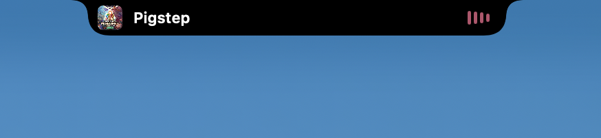
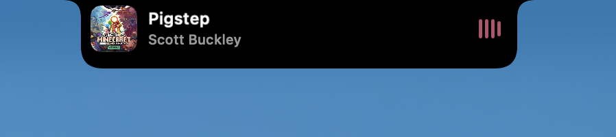
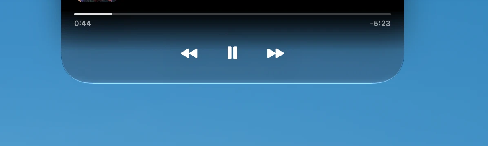

# Liquid Island

The iPhone's Dynamic Island, on macOS. Open, free and configurable.

*[Русская версия](README.md)*

The island grows out of the top edge of the screen: on Macs with a notch it is
indistinguishable from it, on the rest it takes its place. It shows what's
playing, reacts to volume, brightness and power, and expands into a player with
real macOS Liquid Glass.


At rest the island is indistinguishable from a notch. Start playing something
and it shows the track:



Hovering grows it and reveals the artist:



A click expands it into the player, with liquid glass along the bottom:



## Features

**Music.** Title, artist, artwork, progress and transport controls. The
equalizer is driven by real audio and takes its colour from the artwork.
Clicking the artwork switches to the app the music is coming from.

**System HUDs.** Volume, brightness and power connection appear in the island
and dismiss themselves.

**Liquid Glass.** The lower part of the expanded island is native macOS 26
Liquid Glass, living by the system's own transparency and contrast settings.

**Gestures.** Hover shows the track, a click expands the player, a trackpad
swipe right dismisses the card and a swipe back restores it.

## Requirements

- macOS 15 or later
- macOS 26 or later for liquid glass
- Xcode 26 or later to build

## Installation

Download the `.dmg` from [releases](https://github.com/MakrSas/liquid-island/releases)
and drag the app into Applications.

**On first launch macOS will say the app is damaged or unverified.** Nothing is
broken: the project has no paid developer certificate, so the build is neither
signed nor notarised. Clear the quarantine flag:

```bash
xattr -dr com.apple.quarantine /Applications/LiquidIsland.app
```

After that it opens with a normal double click. If you'd rather not run
commands, build from source — a locally built app carries no quarantine flag.

## Building from source

```bash
./Scripts/bundle.sh release
open build/LiquidIsland.app
```

The distributable image is built with:

```bash
./Scripts/dmg.sh
```

The app lives in the menu bar under a capsule icon. Settings are there too.

## Settings

The settings window opens from the menu bar or by right-clicking the island.
Everything applies live: sizes, corner radii, colours, animation springs with
curves, behaviour and HUDs.

Underneath it is plain JSON —
`~/Library/Application Support/LiquidIsland/theme.json`. It is re-read on the
fly, so you can edit it by hand. Every key is described in
[SETTINGS.md](SETTINGS.md) (in Russian).

## Permissions

**Automation** — to read the track title from Spotify and Music.
**Audio recording** — so the equalizer follows real sound. Without it the
island draws a steady wave.

Both are requested on first use and both are optional.

## What didn't work out, and why

**Metadata from arbitrary apps.** The system's Now Playing lives in the private
MediaRemote framework, and since macOS 15.4 Apple has closed it to apps without
a special entitlement: the daemon replies with an empty dictionary. Verified
both by calling it directly and by loading the framework inside an
Apple-signed process. So track titles are only available from apps with
scripting support — Spotify and Music. Other sources, Telegram included, are
detected by sound through CoreAudio: the island shows which app is playing, but
not what.

**Glass needs a key window.** `NSGlassEffectView` only renders real liquid
glass in a key window, otherwise it degrades to a flat blur. The island takes
key focus for the moment of drawing and gives it straight back, so focus is
lost only for an instant. This can be turned off in settings, along with the
glass.

## License

MIT.
