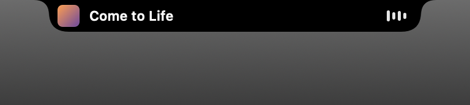
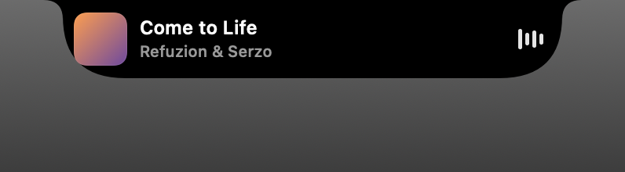
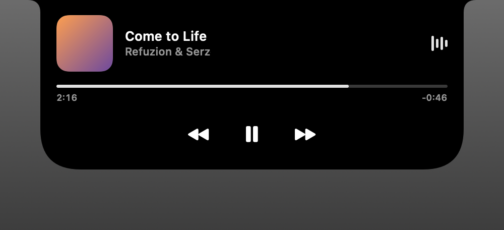

# Liquid Island

Dynamic Island с iPhone — на macOS. Открытый, бесплатный и настраиваемый.

Остров врастает в верхнюю кромку экрана: на маках с чёлкой он от неё
неотличим, на остальных занимает её место. Показывает, что играет, реагирует
на громкость, яркость и зарядку, а в раскрытом виде показывает плеер с
настоящим жидким стеклом macOS.



## Что умеет

**Музыка.** Название, исполнитель, обложка, прогресс и управление. Эквалайзер
двигается от настоящего звука и окрашивается в цвет обложки. Клик по обложке
переводит в приложение, откуда идёт музыка.

**Плашки системных событий.** Громкость, яркость, подключение зарядки —
появляются в острове и уходят сами.

**Жидкое стекло.** Нижняя часть раскрытого острова — нативное Liquid Glass
macOS 26, живущее по системным правилам прозрачности и контраста.

**Жесты.** Наведение показывает трек, клик раскрывает плеер, свайп по тачпаду
вправо убирает карточку, влево возвращает.

| Покой | Наведение | Раскрытый |
|---|---|---|
|  |  |  |

## Требования

- macOS 15 и новее
- Для жидкого стекла — macOS 26 и новее
- Xcode 26 и новее для сборки

## Сборка

```bash
./Scripts/bundle.sh release
open build/Liquid\ Island.app
```

Приложение живёт в меню-баре под значком капсулы. Там же — настройки.

## Настройки

Окно настроек открывается из меню-бара или правым кликом по острову. Всё
меняется на лету: размеры, скругления, цвета, пружины анимаций с графиками,
поведение, плашки.

Под настройками лежит обычный JSON —
`~/Library/Application Support/LiquidIsland/theme.json`. Он читается на лету,
так что править можно и руками. Полное описание ключей: [SETTINGS.md](SETTINGS.md).

## Разрешения

**Автоматизация** — чтобы читать название трека из Spotify и Музыки.
**Запись звука** — чтобы эквалайзер двигался от настоящего звука. Без неё
остров рисует ровную волну.

Оба разрешения запрашиваются при первом обращении, и оба необязательны.

## Что не получилось и почему

**Метаданные из произвольных приложений.** Системный Now Playing живёт в
приватном MediaRemote, и с macOS 15.4 Apple закрыла его для приложений без
специального энтайтлмента: демон отвечает пустым словарём. Проверено и через
прямой вызов, и через загрузку фреймворка в Apple-подписанный процесс.
Поэтому названия треков доступны только у приложений со скриптовой
поддержкой — Spotify и Музыка. Остальные источники, включая Telegram,
определяются по звуку через CoreAudio: остров покажет, какое приложение
играет, но не что именно.

**Стекло требует ключевого окна.** `NSGlassEffectView` рисует настоящее
жидкое стекло только в ключевом окне, иначе выдаёт плоское размытие.
Остров забирает ключ на момент отрисовки и сразу отдаёт обратно — фокус
теряется на мгновение. Выключается в настройках вместе со стеклом.

## Лицензия

MIT.
